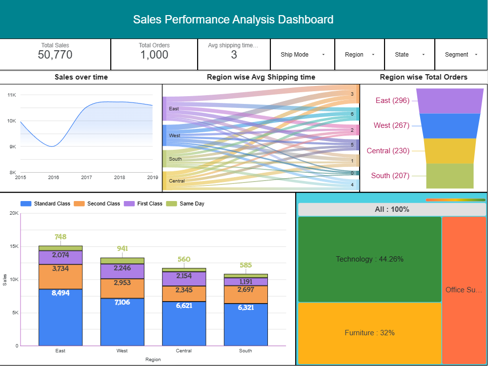

# Sales-Performance-Analysis-Report-Using-Looker-Studio
## Dashboard Preview

## Live Dashboard
[View Dashboard](https://datastudio.google.com/reporting/9e472523-3ca0-4da5-9b61-8ed41fc31afa)
## data file
[View data file](https://docs.google.com/spreadsheets/d/1Rb75XYDucsCnSfYjqG3Dkas5dkIZc6m6S0gvhdSKBNs/edit?gid=1117405085#gid=1117405085)
# Project Overview
Developed an interactive sales analytics dashboard using Google Looker Studio. 
Designed to analyze sales trends, regional performance, shipping efficiency, and product category contribution. 
Helps businesses make data-driven decisions through visual insights and interactive reporting. 
# Key Features
Sales performance tracking over time 
Region-wise total orders analysis 
Average shipping time monitoring 
Product category contribution visualization 
Interactive filters for Region, State, Segment, and Ship Mode 
Dynamic charts and KPI cards 
# Key Insights
Total Sales: 50,770 
Total Orders: 1,000 
Average Shipping Time: 3 Days 
East region recorded the highest number of orders 
Technology category contributed the highest sales share 
# Tools & Technologies
Google Looker Studio 
Data Visualization 
Dashboard Design 
Business Analytics 
# Objective
To build an interactive dashboard for monitoring sales performance and identifying business trends. 
To provide meaningful insights into customer behavior, operational efficiency, and regional sales performance. 
